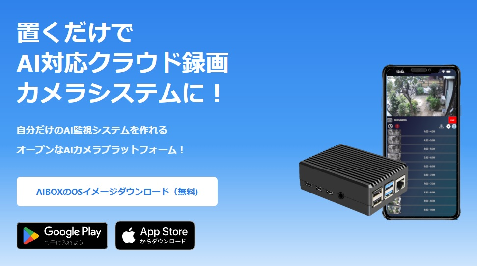
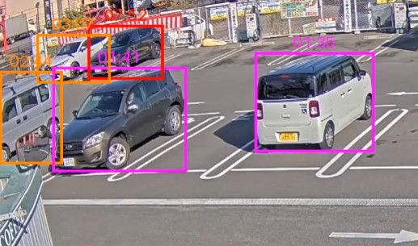

# AI検知プログラム集

このリポジトリには、標準搭載のAI検知プログラムや差し替え用プログラムを収録しています。  

## [AIBOX OS 標準搭載AI検知プログラム](./programs/built-in-object-detection)
AIBOX OSに標準搭載のAI検知プログラムです

## [熊撃退プログラム](./programs/bear_repellent)
熊などの物体を検知するとPush通知と共に音を出して害獣を追い払います。

## [長時間駐車車両検出プログラム](./programs/stay_counter)
長時間駐車している車両を検出してPush通知を送信する検知プログラムです。

YOLO11のトラッキングを使用して、認識した物体の静止している時間を計測します。

## ライセンス

このプロジェクトは MIT License で公開されています。詳細は LICENSE ファイルを参照してください。