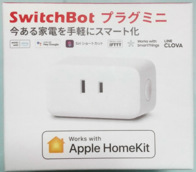

# 検知したら電源ON

SwitchBot プラグミニをBluetooth経由で制御し、人などを検知すると、電源をONにするプログラムです。
指定時間すぎると自動でOFFになります。

帰宅時に自動でライトを照らす、などの用途に使えます。

[プログラムの説明はこちら](https://aicap.daddysoffice.com/ja/overview_power_on_appliance.html)
